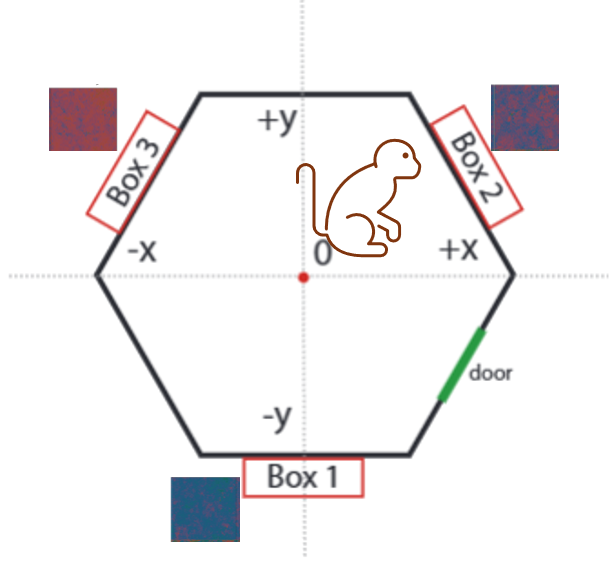

# <span style='color:#03a9fc'> Three-Box Foraging Behavioral Analysis </span>
This is where I perform all my analyses of the behavioral data in the box foraging task. This repo is organized into the following sections:

1. `data` - this folder contains experiment data as well as any data structures generated by the code. Experiment data can be downloaded upon request and placed in `data/experiments`. Pre-existing data structures useful for analysis may be found under `data/analysis`.
2. `docs` - this folder contains useful documentation about the experiment, results, etc. Some of the files are directly generated from notebooks contained in `notebooks`.
3. `figures` - this folder is used to contain any figures generated by scripts.
4. `notebooks` - this folder contains jupyter notebooks that interface with the `foraging` package to render results and figures.
   + start with the `Data Cleaning` notebook first to get an overview of the data and how it's cleaned. Then proceed to the `Data Exploration` and then the `Learning` notebook.
5. `src` - this folder contains the `foraging` package, which you should install locally in your environment. See steps to setup below.

To solely read through results, navigate the `docs` folder. To generate or modify figures, go to `notebooks`.

# <span style='color:#fa5cbe'> Dependencies </span>
You can see the full list in the `pyproject.toml` under the `dependencies` field. There are also optional dev dependencies listed under `project.optional-dependencies`.

# <span style='color:#fa0c9f'> Setup </span>
Here are a couple tested ways to quickly set up an environment

### 1. Unidep
With [Unidep](https://github.com/basnijholt/unidep/tree/main?tab=readme-ov-file#jigsaw-build-system-integration), you can install the `foraging` package along with conda + pip dependencies in one line. It first tries to install whatever packages it can using conda, setting up a conda environment in the process, then installs remaining packages using pip, and then finally installs the `foraging` package. Just run:

```
unidep install -n <YOUR_ENV> pyproject.toml
```

or

```
unidep install -e -n <YOUR_ENV> pyproject.toml
```

to install in editable mode.

### 2. Conda
Create a conda environment from `environment.yml` by running:

```
conda env create --name <YOUR_ENV> --file environment.yml
```

then use pip to install the `foraging` package as in option 3. Make sure to activate the newly created conda environment so that pip can detect the installed dependencies, otherwise it will install those from scratch, too.

### 3. Pip
To install the package and its dependencies, cd to the root of the repo and run:

```
pip install .
```

or in editable mode, where you may wish to edit the package files, run:

```
pip install -e .
```

## Testing

Unit tests can be found in `src/foraging/tests` and run in terminal with the command `pytest src/foraging/tests`

# <span style='color:#22c793'> Task </span>

In the box foraging task, subjects aim to maximize their reward over time by interacting with boxes for reward. Boxes are placed equidistantly from each other in an arena, and reward arrives stochastically at each box according to that box's mean schedule. Depending on how many boxes there are, there can be a fast, medium, and slow box. Subjects also get observations in the form of a noisy color cue whose mean pixel value encodes the time until reward. Below is a schematic of the task.



# <span style='color:#ff9d00'> Tricks and Tips </span>

Some useful tricks and tips for this project are detailed here.

## Generating HTML from notebook
After running the `percent .py` notebooks, you can use `jupytext` to convert them to whatever you like, including HTML. Personally, I like keeping a local `.ipynb` notebook that is paired with a `percent.py` notebook. To generate a `.ipynb` notebook from a `percent py` notebook, run:

```
jupytext --sync <notebook>.py
```

and convert the `.ipynb` to HTML without code by running:

```
jupyter nbconvert --to html <notebook>.ipynb --TemplateExporter.exclude_input=True
```

## Pre-commit
If using `precommit`, I have found that the easiest way to avoid [git staging hell](https://stackoverflow.com/questions/76038513/isort-black-strange-behavior) is to run:

```
pre-commit run --all-files
git commit -am <your_message_here>
```

If you ever want to skip pre-commit, you can run:

```
git commit --no-verify -am <your_message_here>
```

### Contact: nquazi@andrew.cmu.edu
